<!-- ============================== HERO ============================== -->

 

  

---

## `$ whoami`

I'm **M Harshavardhana**, a Computer Science Engineering undergraduate interested in **AI/ML, Natural Language Processing, Retrieval-Augmented Generation, Agentic AI, Computer Vision, and Full-Stack Development**.

I enjoy building practical systems that combine intelligent models with real-world applications — from AI-powered campus assistants and location-aware navigation to satellite image analysis and full-stack web applications.

- 🤖 **Applied AI** — RAG, NLP, LLM applications, agentic systems and multi-agent architectures
- 🧠 **Machine Learning** — Deep Learning, Computer Vision, model development and evaluation
- 🛰️ **Intelligent Applications** — satellite image analysis, geospatial systems and AI-powered decision support
- 🌐 **Full-Stack Development** — React, Next.js, FastAPI, Express.js and REST APIs
- 🗄️ **Data & Infrastructure** — PostgreSQL, PostGIS, MongoDB, Redis, ChromaDB and Docker
- 🎓 **Computer Science Engineering** — Global Academy of Technology · Class of 2027

> **Data → Model → API → Interface** — I like building the complete system.

 

<table>
<tr>
<td align="center">

<b>🤖 AI / ML</b> 
RAG · NLP · LLMs · Computer Vision

</td>
<td align="center">

<b>🌐 Full-Stack</b> 
React · Next.js · FastAPI · Express

</td>
<td align="center">

<b>🗄️ Data</b> 
PostgreSQL · PostGIS · MongoDB

</td>
<td align="center">

<b>🔧 Engineering</b> 
Git · Docker · REST APIs

</td>
</tr>
</table>

 

## 🚀 Featured Projects

<table>
<tr>

<td width="50%" valign="top">

<h3>
<a href="https://github.com/harsha282004/GAT-AI-Virtual-Campus">
🎓 GAT AI Virtual Campus
</a>
</h3>

An AI-powered virtual campus platform designed to help students and visitors explore campus information, ask questions using natural language, and navigate campus locations through an intelligent assistant.

Python · FastAPI · React · Next.js · PostgreSQL · PostGIS · Redis · ChromaDB · SentenceTransformers · RAG

</td>

<td width="50%" valign="top">

<h3>
<a href="https://github.com/harsha282004/Satellite-Image-Change-Detection-System">
🛰️ Satellite Image Change Detection System
</a>
</h3>

A deep-learning based computer vision project for detecting meaningful changes between satellite images using remote-sensing imagery and change-detection techniques.

Python · PyTorch · Deep Learning · U-Net · Siamese Networks · Vision Transformers

</td>

</tr>

<tr>

<td width="50%" valign="top">

<h3>
<a href="https://github.com/harsha282004/CodeAlpha_FullStack_Internship">
💻 CodeAlpha Full-Stack Internship
</a>
</h3>

Full-stack development projects completed during my CodeAlpha internship, covering frontend development, backend APIs, authentication, database integration and application workflows.

React · Vite · Tailwind CSS · Express.js · PostgreSQL · Prisma · REST API · JWT

</td>

<td width="50%" valign="top">

<h3>
<a href="https://github.com/harsha282004/CODSOFT">
📊 CODSOFT Data Science Projects
</a>
</h3>

Data science projects completed during my CodSoft virtual internship, focusing on practical machine learning, data analysis and model development workflows.

Python · Jupyter Notebook · Pandas · NumPy · Matplotlib · Machine Learning

</td>

</tr>

<tr>

<td width="50%" valign="top">

<h3>
<a href="https://github.com/harsha282004/Portfolio">
🌐 Personal Portfolio
</a>
</h3>

My personal developer portfolio showcasing my projects, technical skills, experience and work across software development and AI/ML.

JavaScript · React · Web Development · UI/UX

</td>

<td width="50%" valign="top">

<h3>
<a href="https://github.com/harsha282004?tab=repositories">
📁 More Projects
</a>
</h3>

Explore my GitHub repositories for additional academic projects, experiments, development work and ongoing builds.

</td>

</tr>
</table>

 

## 💡 Current Focus

<table>
<tr>

<td width="50%" valign="top">

### 🤖 AI & Intelligent Systems

- Retrieval-Augmented Generation
- Natural Language Processing
- Large Language Model applications
- Agentic AI
- Multi-agent architectures
- Tool-calling systems

</td>

<td width="50%" valign="top">

### 🧠 Machine Learning

- Deep Learning
- Computer Vision
- Satellite Image Analysis
- Change Detection
- Model evaluation
- Data preprocessing

</td>

</tr>

<tr>

<td width="50%" valign="top">

### 🌐 Software Development

- React / Next.js
- FastAPI
- Express.js
- REST API development
- Full-stack applications
- Responsive UI development

</td>

<td width="50%" valign="top">

### 🗄️ Data & Infrastructure

- PostgreSQL / PostGIS
- MongoDB
- Redis
- ChromaDB
- Docker
- Git & GitHub

</td>

</tr>
</table>

 

## 🛠️ Technical Skills

### 🤖 AI / Machine Learning

### 🌐 Web & Full-Stack

### 🗄️ Databases & Infrastructure

### 🔧 Languages & Tools

 

## 📊 GitHub Activity

  
  

  

  

<!-- ============================== 3D GITHUB CONTRIBUTION GRAPH ============================== -->

  

<!-- ============================== GITHUB SNAKE ============================== -->

<picture>
  <source
    media="(prefers-color-scheme: dark)"
    srcset="https://raw.githubusercontent.com/harsha282004/harsha282004/output/github-snake-dark.svg"
  />
  <source
    media="(prefers-color-scheme: light)"
    srcset="https://raw.githubusercontent.com/harsha282004/harsha282004/output/github-snake.svg"
  />
  
</picture>

 

## 🤝 Let's Connect

I'm interested in opportunities and collaborations around:

**AI/ML · NLP · RAG · Agentic AI · Computer Vision · Full-Stack Development**

 

 

> **Build it. Understand it. Improve it.**

 

⭐ If you find something useful here, feel free to explore my repositories.

  

